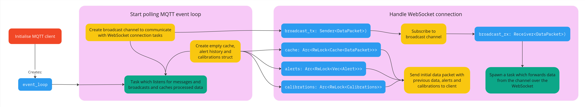

# Relay Server

This is responsible for receiving raw data from the MQTT broker, processing it, triggering alerts, and making sure it all gets to the frontend.

It exposes a WebSocket endpoint for clients to connect: `wss://dashboard.alex-berry.net:8443` (as well as an insecure version on port 8080 because we couldn't get TLS on some non-browser clients). The server also posts alerts to the social media alerting system.

## To whoever reviews this:

We don't know the extent of your Rust knowledge, and we've argued at great lengths about how much should be commented. This has been reviewed by another team member who knows only a little bit of Rust and I've added enough comments for him to understand, so I hope that will also be enough for you. If it comes down to it you can skim [this Rust cheat sheet](https://dev.to/moekatib/the-completesh-rust-cheat-sheet-4fnn) which should cover enough for you to be able to understand everything.

If anything doesn't make sense, it's most likely going to be the structure of the project more than anything else. To help with this I've made a diagram which roughly shows the flow of the program:

